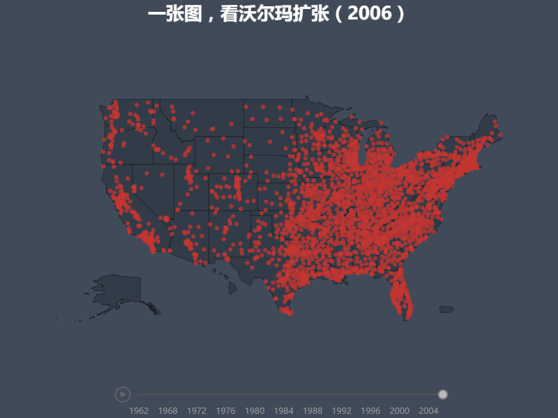

# walmart

最初从[flowingdata](http://flowingdata.com/2010/04/07/watching-the-growth-of-walmart-now-with-100-more-sams-club/)上看到了沃尔玛扩张的视频，原作者是用R语言写的。我把xml数据重新整理成json格式，用[Echarts](http://echarts.baidu.com/)实现了一个类似的可视化效果。

